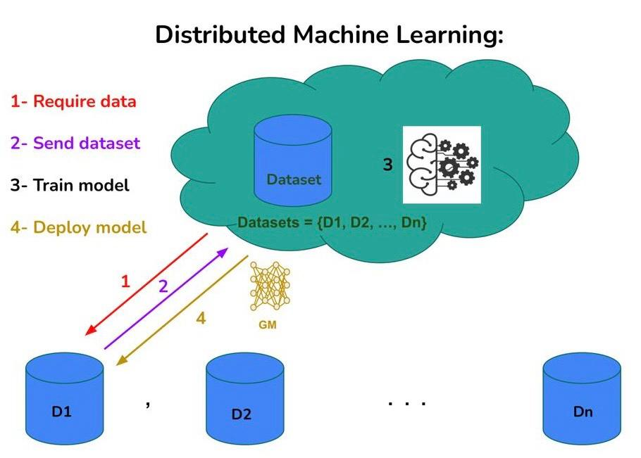
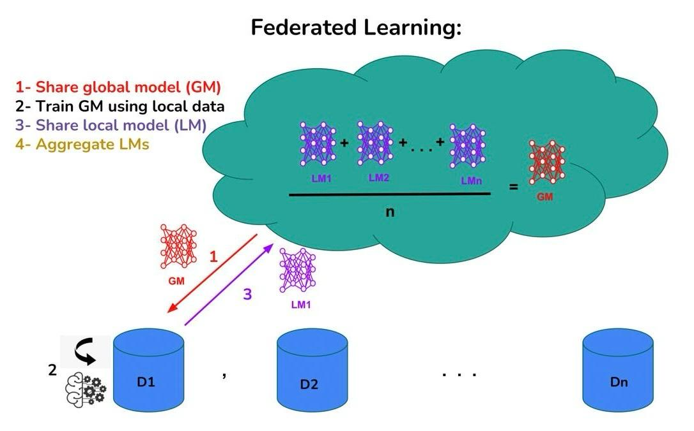
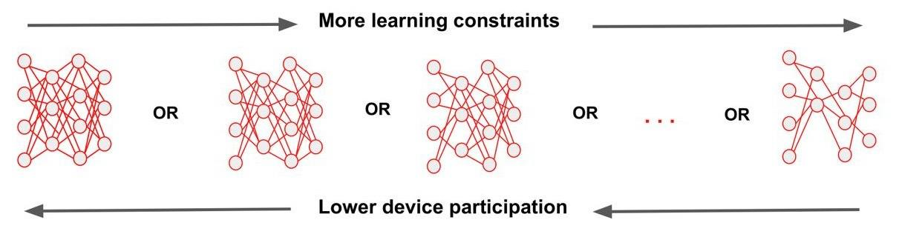
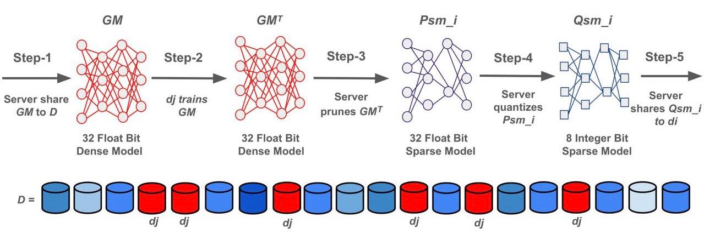

# HybridCompFL: Model-Heterogeneous Federated Learning via Data-free Hybrid Model Compression

**Authors:**

**Affiliation:**


To run experiments and visualize results, install the required packages using Python (version 3.10 or higher):

```python
pip install -r requirements.txt
```


<p align="center">
  
  
  <em>  <br><be> Figure 2: The left shows the DML. The right shows the FL. </em>
</p>


| Model & Dataset   | Aggregation Strategy | Global Round | Total Devices in the System | Participation Rate | Percentage of Capable Devices | Local Epoch | Batch Size | Optimizer | Learning Rate |
|-------------------|----------------------|--------------|-----------------------------|--------------------|-------------------------------|-------------|------------|-----------|---------------|
| VGG16 & CIFAR10   | FedAVG               | 50           | 100                         | 0.5                | 0.2                           | 5           | 64         | Adam      | 0.001         |
| AlexNet & FMNIST  | FedAVG               | 10           | 50                          | 0.5                | 0.2                           | 5           | 64         | Adam      | 0.001         |
| LeNet & MNIST     | FedAVG               | 10           | 50                          | 0.5                | 0.2                           | 5           | 64         | Adam      | 0.001         |








> [!NOTE]
>
> > In the current version of the code, min_nonzero=0.01 this cause a high sparsification result during quantization (While sparsification amount is 0.1, and sparsification % of sparsed model is 10%, for the quantized model it can increase to about 60%, due to many weights in the VGG16 trained with CIFAR10 to be smaller then 0.01).
