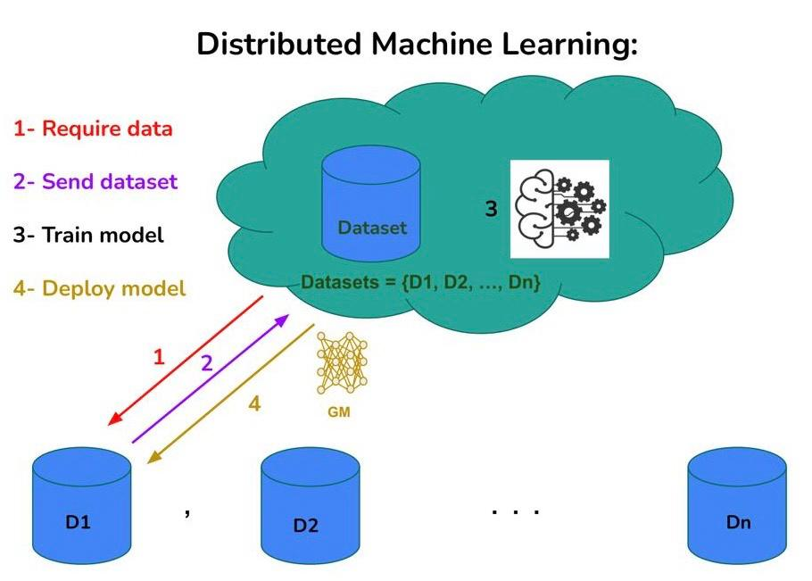
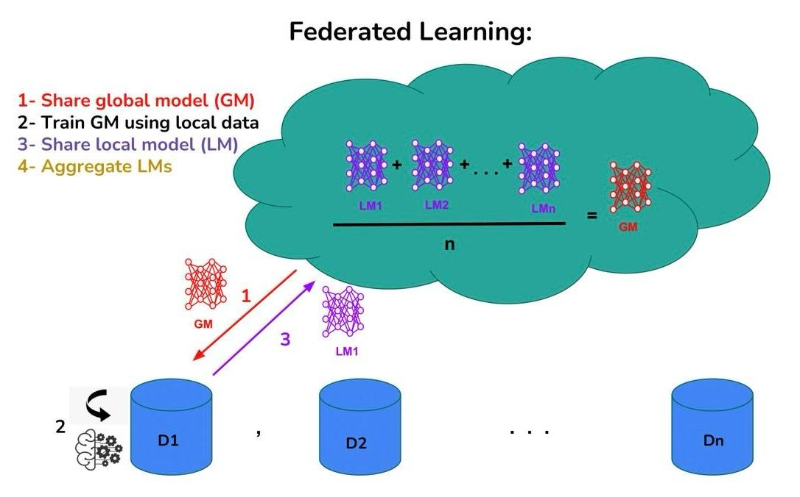
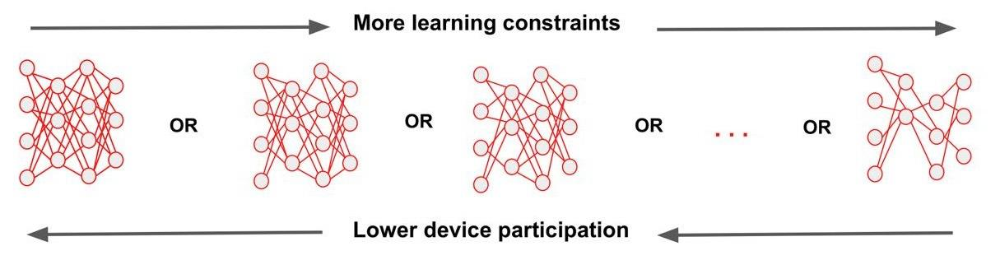
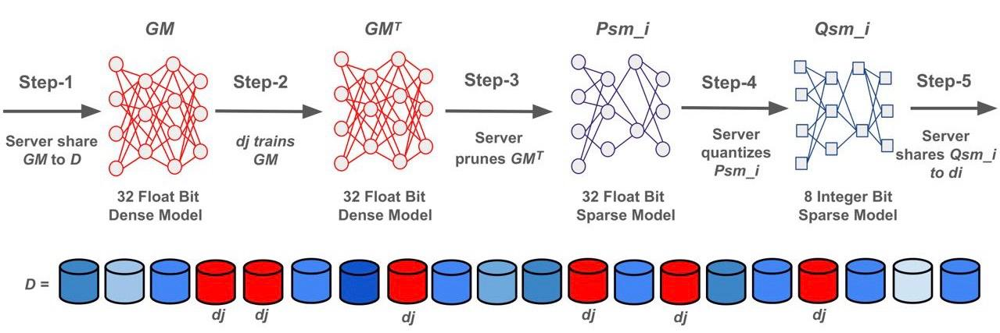

**⚠️ This README is currently under construction. Please check back later for updates. We appreciate your patience as we finalize the documentation. **

# HybridCompFL: Model-Heterogeneous Federated Learning via Data-free Hybrid Model Compression

This repository introduces the source code of the "Resource-aware Models via Pruning and Quantization in Heterogeneous Federated Learning" paper.

**Authors:** [Zeyneddin Oez](https://orcid.org/0000-0002-4216-9854), [Farshad Taebi], [Saeedeh Ghanadbashi](https://orcid.org/0000-0003-0983-301X), [Muhammad Farooq], [Abdollah Malekjafarian](https://orcid.org/0000-0003-1358-1943), [Kristof Van Laerhoven](https://orcid.org/0000-0001-5296-5347), and [Fatemeh Golpayegani](https://orcid.org/0000-0002-3712-6550)

**Affiliation:** [**University of Siegen**](https://www.uni-siegen.de/start/), and [**University College Dublin**](https://www.ucd.ie/)

**Abstract:** 
  Federated Learning (FL) is a privacy-preserving distributed machine learning paradigm that trains models on-device and aggregates local updates to form a global model. However, resource-constrained edge devices often struggle with dense deep neural networks due to high computational demands, unreliable connectivity, and heterogeneity, leading prior approaches to exclude them (despite their unique data) or deploy smaller, less capable models. To address this, we propose a data-free hybrid compression framework that generates lightweight submodels via server-side pruning and quantization. The workflow includes: (i) distributing a dense model to all devices, (ii) training it locally on capable devices across specified global rounds, (iii) applying multiple pruning levels at the server to create sparsified variants of the aggregated model, (iv) quantizing these sparsified models to produce compressed, resource-efficient submodels, and (v) distributing the submodels to remaining constrained devices for use as optimized initial models. These models can then be tuned locally for personalization and performance improvement, or they can be used for further FL training among constrained devices for collaborative refinement. These submodels serve as optimal starting points that strike a balance between size, sparsity, and performance, enabling broader participation. Empirical evaluations across multiple models and datasets demonstrate that, under realistic constraints (e.g., 10\% capable devices, 60\% participation per round, imbalanced data distributions), submodels achieve 3.4x–4x size reductions with 40–60\% sparsity while retaining over 90\% of the original weighted F1 score. 

  
  
  <em>   <be> Figure 1: Each cylinder represents a device, and $\mathit{d}_{n}$ is the local dataset of the $n$-th device. The left figure shows that the server requires all data to train a central model (CM) in this system. For instance, device $d_1$ shares its datasets to participate to system, so that the server can train a central model and then deploy it to device  $d_1$. This process is the same for all devices in $$\(D = \{d_1, d_2, \ldots, d_n\}\)$$. The right figure shows Federated Learning. Here, the initial Global Model ($GM$) is generated by random weights and distributed over $D$ devices. Then, the weights of $\mathit{GM}$ are updated (tuned) to generate Local Models (\(LMs = \{LM_1, LM_2, \ldots, LM_n\}\)) on the device side using local data. Afterwards, $LMs$ are shared with the server, and then the server alters the $GM$ by aggregating gathered $LMs$. The process for $d_1$ is the same for every device, and this process is called the global round. At the end of the $N$ global round, each device owns a model that is trained with all datasets, without sharing local data and seeing any other devices' datasets.

 </em>

| Model & Dataset   | Aggregation Strategy | Global Round | Total Devices in the System | Participation Rate | Percentage of Capable Devices | Local Epoch | Batch Size | Optimizer | Learning Rate |
|-------------------|----------------------|--------------|-----------------------------|--------------------|-------------------------------|-------------|------------|-----------|---------------|
| LeNet & MNIST     | FedAVG               | 50           | 50                          | 0.6                | 0.1                           | 5           | 64         | Adam      | 0.001         |
| AlexNet & FMNIST  | FedAVG               | 50           | 50                          | 0.6                | 0.1                           | 5           | 64         | Adam      | 0.001         |
| VGG16 & CIFAR10   | FedAVG               | 100          | 50                          | 0.6                | 0.2                           | 5           | 64         | Adam      | 0.001         |

> [!NOTE]
>
> > In the current version of the code, min_nonzero=0.01, this causes a high sparsification result during quantization (While sparsification amount is 0.1, and sparsification % of sparsed model is 10%, for the quantized model it can increase to about 60%, due to many weights in the VGG16 trained with CIFAR10 being smaller than 0.01).
