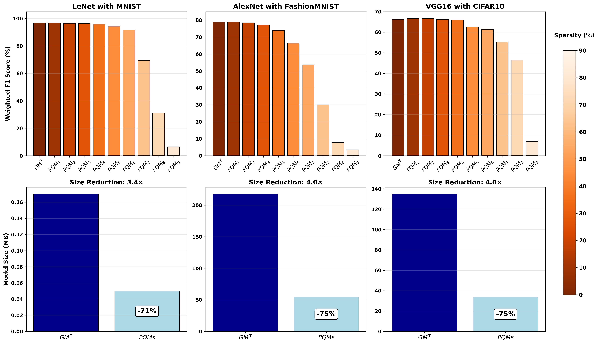

**⚠️ This README is currently under construction. Please check back later for updates. We appreciate your patience as we finalize the documentation. **

# HybridCompFL: Model-Heterogeneous Federated Learning via Data-free Hybrid Model Compression

This repository introduces the source code of the "Resource-aware Models via Pruning and Quantization in Heterogeneous Federated Learning" paper.

**Authors:** [Zeyneddin Oez](https://orcid.org/0000-0002-4216-9854), [Farshad Taebi], [Saeedeh Ghanadbashi](https://orcid.org/0000-0003-0983-301X), [Muhammad Farooq], [Abdollah Malekjafarian](https://orcid.org/0000-0003-1358-1943), [Kristof Van Laerhoven](https://orcid.org/0000-0001-5296-5347), and [Fatemeh Golpayegani](https://orcid.org/0000-0002-3712-6550)

**Affiliation:** [**University of Siegen**](https://www.uni-siegen.de/start/), and [**University College Dublin**](https://www.ucd.ie/)

**Abstract:** 
  Federated Learning (FL) is a privacy-preserving distributed machine learning paradigm that trains models on-device and aggregates local updates to form a global model. However, resource-constrained edge devices often struggle with dense deep neural networks due to high computational demands, unreliable connectivity, and heterogeneity, leading prior approaches to exclude them (despite their unique data) or deploy smaller, less capable models. To address this, we propose a data-free hybrid compression framework that generates lightweight submodels via server-side pruning and quantization. The workflow includes: (i) distributing a dense model to all devices, (ii) training it locally on capable devices across specified global rounds, (iii) applying multiple pruning levels at the server to create sparsified variants of the aggregated model, (iv) quantizing these sparsified models to produce compressed, resource-efficient submodels, and (v) distributing the submodels to remaining constrained devices for use as optimized initial models. These models can then be tuned locally for personalization and performance improvement, or they can be used for further FL training among constrained devices for collaborative refinement. These submodels serve as optimal starting points that strike a balance between size, sparsity, and performance, enabling broader participation. Empirical evaluations across multiple models and datasets demonstrate that, under realistic constraints (e.g., 10\% capable devices, 60\% participation per round, imbalanced data distributions), submodels achieve 3.4x–4x size reductions with 40–60\% sparsity while retaining over 90\% of the original weighted F1 score. 

  
  

**Figure 1:** *Working steps of Centralized Learning vs Federated Learning.*

The left figure in Figure 1 shows that the server requires all data to train a central model (CM) in this system. For instance, device $d_1$ shares its datasets to participate to the system, so that the server can train a central model and then deploy it to device $d_1$. This process is the same for all devices in $D = \{d_1, d_2, \dots, d_n\}$. 

The right one shows Federated Learning. Here, the initial Global Model ($GM$) is generated by random weights and distributed over $D$ devices. Then, the weights of $GM$ are updated (tuned) to generate Local Models ($LMs = \{LM_1, LM_2, \dots, LM_n\}$) on the device side using local data. Afterwards, $LMs$ are shared with the server, and then the server alters the $GM$ by aggregating gathered $LMs$. The process for $d_1$ is the same for every device, and this process is called the global round. At the end of the $N$ global round, each device owns a model that is trained with all datasets, without sharing local data and seeing any other devices' datasets.

**Figure 2:** *The trade-off in adopting a homogeneous model approach within Standard Federated Learning (S-FL).*

As Figure 2 illustrates, in standard Federated Learning, the system's behaviour is influenced by the selection of a static global model. In heterogeneous environments, as the size of the global model increases, the number of participating devices decreases. Conversely, reducing the size of the global model may result in too few parameters to capture the underlying patterns in the datasets effectively. 

**Figure 3:** *Data-free server-side hybrid model compression steps.*

To bridge these gaps, we combine and implement data-free model pruning and quantization methods on the server side to prevent extra workload on resource-constrained devices (see Figure 3). Correspondingly, we introduce a framework designed to address both device heterogeneity and communication overhead challenges of FL. Our framework simulated and evaluated realistically, considering a non-IID setting by distributing data imbalanced across devices without overlap using the Dirichlet distribution, creating a more challenging, decentralized scenario for FL. Our approach results in a set of resource-aware submodels that enable resource-constrained devices to obtain optimum models based on their capacity. This is achieved by transferring learned parameters of a compressed pre-trained dense model obtained by capable devices.

Our main contributions are the combination of:

* **Server-Side Data-Free Compression Pipeline:** Our framework introduces the practical viability of a fully server-side compression process that operates without access to client sources, ensuring privacy preservation while removing computational overhead from resource-constrained devices.

* **Hybrid Prune-Then-Quantize Compression for Tunable Submodels:** A novel integration of pruning followed by zero-aware quantization, generating a series of compressed submodels that achieve significant size reductions (3.4x–4x) with minimal performance degradation. Our method preserves sparsity during quantization, reducing memory and energy consumption during inference while enabling faster model communication in FL rounds and facilitating the sharing of resource-aware models on resource-constrained devices for local personalization or further FL, advancing inclusive FL deployment.

* **Realistic Simulation and Empirical Evaluation of FL Scenarios:** Incorporation of capability constraints, partial participation rates, and non-IID data imbalances to simulate real-world FL environments, demonstrating effective training with low overall participation (e.g., 10–20% capable devices). This is complemented by a comprehensive analysis of sparsity, size, and model performance across multiple models and datasets, providing insights into hybrid compression's viability and trade-offs in heterogeneous FL.

The models, datasets, and hyperparameters utilized in this work are listed below:

| Model & Dataset   | Aggregation Strategy | Global Round | Total Devices in the System | Participation Rate | Percentage of Capable Devices | Local Epoch | Batch Size | Optimizer | Learning Rate |
|-------------------|----------------------|--------------|-----------------------------|--------------------|-------------------------------|-------------|------------|-----------|---------------|
| LeNet & MNIST     | FedAVG               | 50           | 50                          | 0.6                | 0.1                           | 5           | 64         | Adam      | 0.001         |
| AlexNet & FMNIST  | FedAVG               | 50           | 50                          | 0.6                | 0.1                           | 5           | 64         | Adam      | 0.001         |
| VGG16 & CIFAR10   | FedAVG               | 100          | 50                          | 0.6                | 0.2                           | 5           | 64         | Adam      | 0.001         |

The results reveal that (see Figure 4), despite substantial compression that requires less memory, energy, and storage demands along with faster communication, many submodels maintain over 90\% of the original weighted F1 score up to 40–60\% sparsity, allowing resources-constrained devices to leverage pretrained compatible models that can be used as initial global models for their FL participation. 

**Figure 4:** *Cross Model-Dataset Combination Comparisons of trained global model and pruned-then-quantized submodels.*

